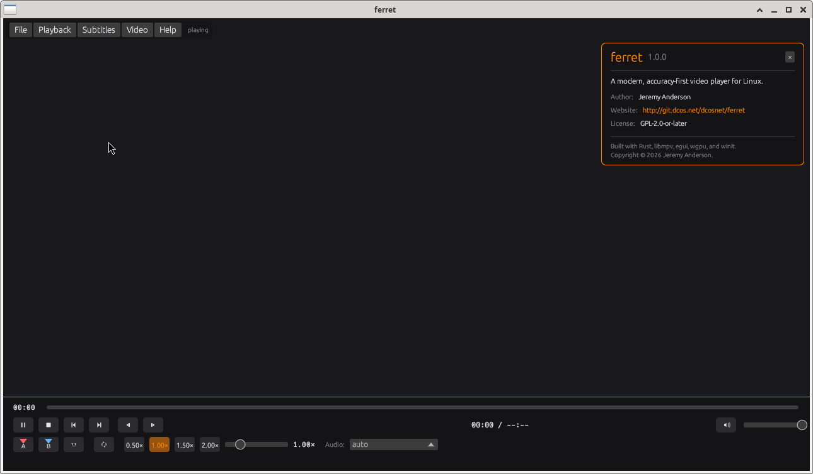

# ferret

**A modern, accuracy-first video player for Linux, written in Rust.**

[](LICENSE)
[](#)
[](https://www.rust-lang.org)



ferret is a desktop video player built on libmpv, with a custom egui overlay UI
rendered in a transparent always-on-top window. The engine runs on its own
thread; the UI never blocks playback. File dialogs are drawn inside the overlay
— no external dialog processes, no z-order conflicts.

- **Author:** Jeremy Anderson
- **Website:** http://git.dcos.net/dcosnet/ferret
- **License:** GPL-2.0-or-later

**Versioning:** the single source of truth is `version` in the workspace
`Cargo.toml`. The Help menu, the About panel, and `ferret --version` all read
it at compile time via `CARGO_PKG_VERSION` — bump the version there and every
surface updates; nothing is hardcoded.

---

## Table of Contents

- [Why ferret?](#why-ferret)
- [Architecture](#architecture)
- [Features](#features)
- [Crates](#crates)
- [Build](#build)
- [Run](#run)
- [Keyboard Shortcuts](#keyboard-shortcuts)
- [Menu Reference](#menu-reference)
- [Control Bar](#control-bar)
- [A/B Markers and Loop Export](#ab-markers-and-loop-export)
- [Subtitles](#subtitles)
- [Video Transforms](#video-transforms)
- [Accuracy-First Error Policy](#accuracy-first-error-policy)
- [Configuration](#configuration)
- [Roadmap](#roadmap)
- [Contributing](#contributing)
- [License](#license)

---

## Why ferret?

ferret sidesteps three root causes of playback stutter on Linux:

1. **Copy-back hardware decoding** shuttling frames over the PCIe bus. ferret
   sets `hwdec=auto-safe` — only zero-copy hardware decode paths
   (VA-API/NVDEC/Vulkan video decode), never copy-back modes.
2. **Software audio amplification** conflicting with PipeWire's logarithmic
   volume curves. ferret hard-caps volume at 100% (`volume_max=1.0`); the
   volume slider maps 1:1 with the system sink.
3. **Push-through error handling** causing visual smearing on corrupt frames.
   ferret sets `framedrop=vo` — drop frames only at display, never on decode.
   Corrupt frames are dropped, never smeared through.

The engine thread owns libmpv exclusively; UI thread hangs never cause AV
stutter because the engine has no knowledge of the UI.

---

## Architecture

```
┌─────────────────────────────────────────────────────────────┐
│ ferret binary (player-app)                                  │
│                                                             │
│  winit event loop (main thread)                             │
│  ├─ Video window ──wid──▶ libmpv ──▶ FFmpeg/Vulkan          │
│  │                          │                                │
│  │                          ├─ decode                       │
│  │                          ├─ AO (PipeWire/PulseAudio)     │
│  │                          └─ VO (Vulkan/OpenGL)           │
│  │                                                          │
│  └─ Overlay window (egui + wgpu, transparent, AlwaysOnTop)  │
│     ├─ Control bar (play/pause, seek, volume, markers)       │
│     ├─ Menu bar (File / Playback / Audio / Subtitles / etc)  │
│     └─ In-UI file browser (replaces external file dialogs)   │
│                                                             │
│  Engine thread (named "ferret-engine")                      │
│  └─ owns MpvHandle, drains libmpv event queue,              │
│     publishes EngineEvents on a bounded channel             │
│                                                             │
│  ffmpeg worker thread (named "ferret-ffmpeg")               │
│  └─ spawned for A-B loop video export, sends result back    │
└─────────────────────────────────────────────────────────────┘
```

**Threading model:** thread-per-subsystem with `crossbeam` channels. No async.
- **Cmd channel** (UI → engine): `bounded::<Cmd>(64)` — bounded for natural backpressure.
- **Event channel** (engine → UI): `bounded::<EngineEvent>(256)` — single consumer.
- **State snapshot**: `Arc<Mutex<PlaybackState>>` (parking_lot) shared between threads.

**Two-window model:** libmpv renders directly into the video window via X11
`wid` embedding. The overlay window is transparent, borderless, and
`AlwaysOnTop` — it covers the video window and renders the UI with egui + wgpu.
An X11 bounding shape is applied over exactly the rects egui painted, so
pointer events over the video area (the "holes") fall through to the video
window — enabling the drag-to-pan gesture and Ctrl+Wheel zoom — while the
overlay still forwards them for hover/auto-show behavior.

**X11 background pixel:** the video window's X11 background pixel is set to
`#141416` via `XSetWindowBackground` before libmpv attaches. This prevents the
X server from showing framebuffer garbage during window resize/move (the
"mirrored desktop" artifact).

**wgpu presentation:** forced to `PresentMode::Fifo` (vsync) for compatibility.
Surface format prefers non-sRGB (`Bgra8Unorm` → `Rgba8Unorm` → sRGB variants)
to avoid egui color-management warnings. Alpha mode is `Auto`.

---

## Features

### Core Playback

- **Play / Pause / Stop** — buttons + keyboard + menu
- **Seek bar** — drag-to-scrub, click-to-jump, hover preview line, A/B marker pins
- **Frame stepping** — step forward/backward one frame at a time
- **Volume** — slider + mute toggle, hard-capped at 100%
- **Fullscreen** — borderless fullscreen toggle

### Loop Modes

- **Off** — play once, stop at EOF
- **Loop File** — repeat the current file indefinitely (`loop-file=inf`)
- **Loop Playlist** — repeat the entire playlist indefinitely (`loop-playlist=inf`)

### Speed Control

- **Quick presets** — 0.50×, 1.00×, 1.50×, 2.00× (control bar buttons)
- **Fine slider** — 0.25× to 4.0× (control bar slider)
- **Keyboard** — `-` / `=` nudge by 0.25×
- **Menu steps** — Playback → Speed offers ±0.25× steps only; no discrete
  preset entries (the slider already covers the full range)

### A/B Markers

- **Set A / Set B** — drop markers at current playback position
- **Marker pins** — drawn on the seek bar (red `#FF6464` for A, blue `#64B4FF` for B)
- **A-B Loop** — loop between markers (mpv's `ab-loop-a` / `ab-loop-b`)
- **Export A-B Loop Video** — renders the segment to a new file via ffmpeg
- **Import/Export Markers** — save/load marker positions as `.txt` or `.json`

All marker controls live in the **Playback** menu (Loop and A-B Markers
sections) and the control bar's marker buttons.

### Random / Shuffle

- **Modes** — Off / Same Folder / Whole Tree / Step-Aware (Playback → Random/Shuffle)
- **Random Next** (`R`) — jump to a random entry per the current mode
- **Cycle mode** (`S`, or the shuffle button in the control bar)

### Queue Sidebar

- Persistent right-hand panel showing the playlist in play order
  (File → Window → Queue Sidebar, or the queue button in the control bar)
- **Reorder** — drag-and-drop rows, or click a row's number and type a new
  1-based position
- **Click to play**, × to remove, **Save As** writes the queue — in the exact
  order shown — to an `.m3u` file

### Video Zoom / Pan

- **Ctrl+Wheel** — zoom in/out on the video
- **Drag the video** — pan while zoomed
- **Video → Zoom / Pan** — menu steps + reset, with a live zoom/pan readout

### File Menu

- **Load File** — in-UI file browser (media extensions filtered)
- **Load Folder** — enumerate video files in a folder as a playlist
- **Load Playlist** — multi-select files (media + `.m3u`/`.m3u8`/`.pls`)
- **Save Playlist As** — write the current queue to an `.m3u` file
- **Toggle Fullscreen** — also the Queue Sidebar toggle under Window
- **Quit**

### Subtitles

- **Embedded track selection** — auto-detects from mpv's `track-list`
- **External subtitle loading** — `.srt`, `.ass`, `.ssa`, `.sub`, `.idx`, `.sup`, `.vtt`, `.smi`, `.lrc`
- **Visibility toggle** — hide subs without losing the selected track
- **Forced track support** — displays `[forced]` badge for forced tracks

### Audio Tracks

- **Track selection** — dropdown with all embedded audio tracks
- **Auto** — let mpv pick the default track
- **Labels** — `1: eng [default]`, `2: Commentary`, etc.

### Video Transforms

- **Rotation** — 0°, 90°, 180°, 270° (mpv `video-rotate` property)
- **Flip Horizontal** — mirror left-right (mpv `vf` filter `hflip`)
- **Flip Vertical** — upside-down (mpv `vf` filter `vflip`)
- **Zoom / Pan** — Ctrl+Wheel zoom, drag-to-pan, menu reset (see above)

### In-UI File Browser

All file selection happens inside the egui overlay — no external dialog
processes (zenity, kdialog, rfd). This eliminates the z-order conflict where
external dialogs would pop under the overlay's `AlwaysOnTop` window. The
browser supports:

- Directory listing with sorted entries (directories first, then files)
- Extension filtering per dialog kind
- Single-select, multi-select (Load Playlist), and save modes (filename input)
- Path bar with Up / Home navigation
- Double-click to navigate into directories

---

## Crates

| Crate | Role |
|---|---|
| `mpv-bindings` | bindgen FFI to libmpv + safe wrapper (`MpvHandle`, `Event`, `Property`, `Command`) |
| `player-core` | Headless engine: `PlayerEngine`, `Cmd`/`EngineEvent` channels, accuracy-first options, `PlaybackState` |
| `player-ui` | egui + wgpu overlay renderer: control bar, menus, in-UI file browser, icons, theme |
| `player-app` | Binary: multi-window winit event loop, X11 wid embedding, keyboard input, ffmpeg export |

---

## Build

### Prerequisites

- **Rust** 1.75+ (install via [rustup](https://rustup.rs))
- **libmpv** 2.x (provided by `setup-libmpv.sh`)
- **libclang** (for bindgen; provided by `setup-libmpv.sh`)
- **ffmpeg** (for A-B loop video export; optional)
- **libX11** (linked directly for `XSetWindowBackground`; usually pre-installed)

### One-time setup (libmpv without root)

```bash
cd /path/to/ferret
./scripts/setup-libmpv.sh
source ./mpv-prefix/env.sh
```

This downloads libmpv2, libmpv-dev, and all runtime dependencies, extracts
them into `./mpv-prefix/`, and writes `./mpv-prefix/env.sh`. The script also
pulls in winit's xkbcommon runtime deps and mesa software rasterizers.

### Build the player

```bash
cargo build --release
```

The release binary is at `target/release/ferret`. rpath is baked in, so no
`LD_LIBRARY_PATH` is needed at runtime.

### Build flags

```bash
./scripts/build.sh           # build release (default)
./scripts/build.sh --debug   # build debug
./scripts/build.sh --clean   # clean + rebuild
./scripts/build.sh --test    # run cargo test --release
./scripts/build.sh --lint    # cargo clippy + bracket audit + deref audit
./scripts/build.sh --ci      # lint + test + build (full CI pass)
```

### Build profiles

```toml
[profile.release]
opt-level = 3
lto = "thin"
codegen-units = 1
strip = "symbols"
panic = "abort"

[profile.dev]
opt-level = 1    # wgpu/shaders benefit from at least -O1
debug = 1
```

---

## Run

```bash
ferret /path/to/video.mp4
```

Or launch with no arguments to get an empty dark grey window with the menu
bar — use **File → Load File...** to open the in-UI file browser.

```bash
ferret --version    # print version (reads Cargo.toml at compile time)
ferret --help       # usage summary
```

---

## Keyboard Shortcuts

Every hotkey has a menu entry and/or a control-bar button. Menu items show
the shortcut in parentheses (e.g. `Play / Pause  (Space)`).

| Key | Action | Menu / Control |
|-----|--------|----------------|
| Space | Play / pause | Playback menu, ▶/⏸ button |
| Q | Quit | File menu |
| F | Toggle fullscreen | File → Window, ⛶ button |
| M | Toggle mute | Playback → Volume, 🔊 button |
| ← / → | Seek -5s / +5s (keyframes) | Playback → Seek |
| ↑ / ↓ | Volume +5% / -5% | Playback → Volume |
| , / . | Frame-step back / forward | Playback → Seek, ◀| / |▶ buttons |
| [ / ] | Set A / B marker | Playback → A-B Markers, A/B buttons |
| \\ | Clear markers | Playback → A-B Markers |
| L | Cycle loop mode (off/file/list) | Playback → Loop, ⟳ button |
| - / = | Speed -0.25× / +0.25× | Playback → Speed, slider |
| N / P | Playlist next / previous | Playback → Playlist, ⏭/⏮ buttons |
| R | Random next | Playback → Random/Shuffle, 🔀 button |
| S | Cycle random mode (off/folder/tree/step) | Playback → Random/Shuffle, 🔀 button |
| V | Toggle subtitle visibility | Subtitles menu |

**Mouse gestures:** Ctrl+Wheel zooms the video in/out; dragging the video
pans while zoomed. The plain wheel is currently unused.

---

## Menu Reference

The menu bar and the control bar auto-hide together after ~3 seconds without
input; moving the mouse over the window brings both back. While a dropdown,
dialog, or panel is open, nothing auto-hides.

### File menu

| Item | Shortcut | Section |
|------|----------|---------|
| Load File... | — | Open |
| Load Folder... | — | Open |
| Load Playlist... | — | Open |
| Save Playlist As... | — | Open |
| Toggle Fullscreen | `F` | Window |
| Queue Sidebar | — | Window |
| Quit | `Q` | — |

### Playback menu

| Item | Shortcut | Section |
|------|----------|---------|
| Play / Pause | Space | — |
| Stop | — | — |
| Forward 5s | → | Seek |
| Backward 5s | ← | Seek |
| Frame Step Forward | `.` | Seek |
| Frame Step Backward | `,` | Seek |
| Next | N | Playlist |
| Previous | P | Playlist |
| Volume Up 5% | ↑ | Volume |
| Volume Down 5% | ↓ | Volume |
| Toggle Mute | M | Volume |
| Off / Loop File / Loop Playlist | — | Loop |
| Cycle Loop Mode | L | Loop |
| A-B Loop (toggle) | — | Loop |
| Set A Marker | `[` | A-B Markers |
| Set B Marker | `]` | A-B Markers |
| Clear Markers | `\\` | A-B Markers |
| Export A-B Loop Video... | — | A-B Markers |
| Import Markers... | — | A-B Markers |
| Off / Same Folder / Whole Tree / Step-Aware | — | Random / Shuffle |
| Random Next | R | Random / Shuffle |
| Cycle Random Mode | S | Random / Shuffle |
| Speed Up +0.25× | = | Speed |
| Speed Down -0.25× | - | Speed |

The Speed section intentionally has no discrete preset entries — the
control-bar slider covers the full 0.25×–4× range continuously.

### Audio menu

Appears only when the loaded file has audio tracks.

- **Auto** — let mpv pick the default track
- **List of embedded audio tracks** — `1: eng [default]`, `2: Commentary`, etc.

### Subtitles menu

- **Load Subtitle File...** — in-UI file browser (subtitle extensions)
- **Show Subtitles** `(V)` — toggle `sub-visibility`
- **None** — disable subtitles
- **List of embedded subtitle tracks** — with `[forced]` / `[default]` badges

### Video menu

- **Rotate:** 0° (normal), 90°, 180°, 270°
- **Flip:** Flip Horizontal (mirror), Flip Vertical (upside-down)
- **Zoom / Pan:** Zoom In (Ctrl+Wheel), Zoom Out, Reset Zoom & Pan, live
  zoom/pan readout

### Help menu

- **About ferret** — toggles the About panel (version, author, license)
- Version: from `Cargo.toml` via `CARGO_PKG_VERSION` — also visible with
  `ferret --version`
- License: `GPL-2.0-or-later`

---

## Control Bar

The bottom control bar (118px tall) has three rows. A status line next to the
menu bar mirrors playback state (playing/paused, speed, loop mode, random
mode, zoom/pan).

### Row 1 — Seek bar
- Current time label (monospace)
- Seek bar with A/B marker pins (red for A, blue for B)
- Duration label (monospace)

### Row 2 — Transport | time | volume + fullscreen
- Play/Pause, Stop, Previous, Next, Frame Back, Frame Forward
- Shuffle button (cycles random mode), Queue sidebar toggle
- Center: `MM:SS / MM:SS` time display
- Right: Fullscreen button, Volume slider, Volume/mute icon

### Row 3 — Markers | loop | speed | audio
- A marker button (shows time or "A"), B marker button (shows time or "B")
- AB-loop toggle, Loop-mode toggle (off/file/playlist)
- Speed presets: 0.50×, 1.00×, 1.50×, 2.00×
- Fine speed slider (0.25×–4.0×), current speed label
- Audio track dropdown

---

## A/B Markers and Loop Export

### Setting Markers

1. Play to the point where you want marker A.
2. Press `[` (or click **Playback → Set A Marker**).
3. Play to the point where you want marker B.
4. Press `]` (or click **Playback → Set B Marker**).

The markers appear as colored pins on the seek bar — red for A, blue for B.

### Looping A→B

When both markers are set, mpv automatically loops between them. The
**A-B Loop** menu item (or the AB-loop button in the control bar)
turns this on/off. When toggled off, the markers are cleared.

### Exporting the A-B Loop

**Playback → Export A-B Loop Video...** opens the in-UI save dialog, then runs
ffmpeg to extract the segment:

```bash
ffmpeg -y \
  -ss <A> \
  -i <input> \
  -t <duration> \
  -c:v libx264 -preset fast -crf 18 \
  -c:a aac -b:a 192k \
  <output>
```

`-ss` is placed before `-i` for fast seeking. Video is re-encoded (libx264,
CRF 18) for frame accuracy and maximum compatibility. Audio is re-encoded to
AAC at 192 kbps. ffmpeg must be installed and in your PATH. The export runs on
a background thread (`ferret-ffmpeg`) so the UI stays responsive.

### Importing/Exporting Markers

Markers can be saved to disk and reloaded later:

**Text format (.txt):**
```
# file: /path/to/video.mp4
# duration: 180.000s
# speed: 1.00x

A 00:01:23.456
B 00:02:45.000
LOOP on
```

**JSON format (.json):**
```json
{"file":"/path/to/video.mp4","duration":180.000,"speed":1.000,"a":83.456,"b":165.000,"loop":true}
```

---

## Subtitles

ferret supports both embedded subtitle tracks (from the container) and
external subtitle files.

### Embedded Tracks

When a file with subtitle tracks is loaded, the **Subtitles** menu populates
with all available tracks. Each track shows its id, language, and any badges
(`[forced]`, `[default]`).

### External Subtitles

**Subtitles → Load Subtitle File...** opens the in-UI file browser filtered
for: `.srt`, `.ass`, `.ssa`, `.sub`, `.idx`, `.sup`, `.vtt`, `.smi`, `.lrc`.
The loaded subtitle becomes active immediately.

### Visibility

**Subtitles → Show Subtitles** `(V)` toggles `sub-visibility` — hides
subtitles without losing the selected track, useful for quickly checking the
raw video.

---

## Video Transforms

### Rotation

**Video → Rotate** sets the `video-rotate` mpv property. Values: 0°, 90°,
180°, 270°. The rotation is applied immediately and reflected in the state.

### Flip

**Video → Flip** toggles mpv video filters:
- **Flip Horizontal** — adds/removes the `hflip` filter (mirror left-right)
- **Flip Vertical** — adds/removes the `vflip` filter (upside-down)

The filters are managed by reading the current `vf` property, adding or
removing the filter name, and writing it back.

---

## Accuracy-First Error Policy

ferret configures libmpv for visual accuracy over continuity:

- **`hr-seek=yes`** — exact seeks, not keyframe-snapped. Seeks take slightly
  longer but land on the requested frame.
- **`framedrop=vo`** — only drop frames at the video output if behind. Never
  drop on decode, so corrupt frames don't get smeared through.
- **`video-sync=display-resample`** — resample audio to match the display
  refresh rate. Best A/V sync, eliminates audio drift.
- **`hwdec=auto-safe`** — use hardware decoding only when known-safe (no
  copy-back modes that shuttle frames over the PCIe bus).
- **`volume-max=100`** — hard-coded. No software amplification past 100%,
  killing the PipeWire volume clash.

These are baked into `EngineOptions::default()` and set as mpv options at
engine init time. User config (`~/.config/mpv/mpv.conf`) is explicitly
disabled (`config=no`) to prevent sneaking in different behavior.

Additional fixed mpv options: `terminal=no`, `msg-level=all=<level>`,
`input-default-bindings=no`, `input-builtin-bindings=no`, `osc=no`,
`cursor-autohide=no`, `input-vo-keyboard=no`, `vo=gpu`.

---

## Configuration

All options are code-defined in `EngineOptions::default()`:
(`crates/player-core/src/options.rs`)

| Field | Default | Purpose |
|-------|---------|---------|
| `hr_seek` | `true` | Exact seeks |
| `framedrop` | `"vo"` | Drop at display only |
| `video_sync` | `"display-resample"` | Resample audio to display |
| `hwdec` | `"auto-safe"` | Safe hardware decode only |
| `initial_volume` | `1.0` (100%) | Startup volume |
| `volume_max` | `1.0` (100%) | Hard cap — never higher |
| `log_level` | `"warn"` | libmpv log threshold |
| `wid` | `None` | Set at runtime from video window XID |
| `vo` | `"gpu"` | Video output driver |
| `loop_mode` | `Off` | Initial loop mode |

There is no config file yet (planned for a future release).

---

## Roadmap

### Done (v1.0)

- Multi-window winit + egui overlay (X11)
- libmpv 2.x FFI via bindgen
- Engine thread with full property observation
- Play/pause/stop/seek/frame-step
- Volume + mute (hard-capped at 100%)
- Loop modes (off/file/playlist)
- Speed control (presets + slider, 0.25×–4×)
- A/B markers + loop + video export via ffmpeg
- Marker import/export (txt + json)
- Audio track selection
- Subtitle track selection + external loading
- Video rotation (0/90/180/270) + flip (H/V)
- In-UI file browser (no external dialog dependency)
- Complete hotkey coverage — every shortcut has a menu entry and/or button
- Accuracy-first error policy
- X11 background pixel fix (eliminates resize/move "mirrored desktop" artifact)
- wgpu surface error recovery + forced `PresentMode::Fifo`
- CI tooling: bracket audit, deref audit, clippy config

### Done (v1.3)

- Queue sidebar — playlist panel with drag-drop reorder, type-a-position
  reorder, click-to-play, per-entry removal, Save As `.m3u`
- Random / shuffle playback — Off / Same Folder / Whole Tree / Step-Aware
  modes, `R` / `S` keys, shuffle button
- Video zoom / pan — Ctrl+Wheel zoom, drag-to-pan, menu reset
- Save Playlist As `.m3u` from the File menu
- A-B controls consolidated under the Playback menu; discrete speed preset
  entries removed (slider covers 0.25×–4×)
- Self-sustaining ~30fps UI repaint ticker — no more frozen/black UI until
  the mouse moves, and auto-hide works with zero input
- X11 input shape on the overlay — pointer events over the video reach the
  video window (pan gesture, zoom wheel) while hover/auto-show still work
- VO health check — visible warning if the video output fails to initialize
  instead of a silent black window
- Version now single-sourced from `Cargo.toml` (Help menu, About panel,
  `ferret --version`)

### Planned

1. **Wayland support** via `mpv_render_context` + `MPV_RENDER_API_TYPE_OPENGL`.
   Eliminates the wid/X11 dependency, unblocks macOS (Metal via wgpu) and
   Windows (DX12 via wgpu).
2. **Config file** (`~/.config/ferret/ferret.toml`).
3. **Media keys** (MPRIS on Linux).
4. **Single-window compositing** — render video as a wgpu texture inside egui,
   eliminating the second window and the click-through limitation.

---

## Contributing

See [CONTRIBUTING.md](CONTRIBUTING.md) for development setup, code style,
coding standards (PEP 868 / POSIX / SEI CERT / MISRA), and pre-commit checks.

Patches are welcome at <http://git.dcos.net/dcosnet/ferret>.

---

## License

ferret is licensed under the [GNU General Public License v2.0](LICENSE)
or (at your option) any later version.

```
ferret - a modern, accuracy-first video player for Linux
Copyright (C) 2026 Jeremy Anderson

This program is free software; you can redistribute it and/or modify
it under the terms of the GNU General Public License as published by
the Free Software Foundation; either version 2 of the License, or
(at your option) any later version.
```

libmpv (linked dynamically) is licensed under LGPL-2.1+ or GPL-2+ — the
dynamic linking keeps ferret's GPL-2.0 compatible.
